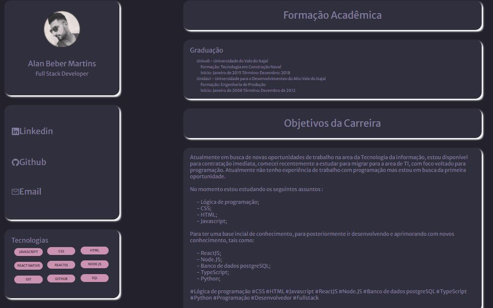

<h1 align="center"> Projeto Portifólio e Currículo </h1>

  <a href="#-tecnologias">Tecnologias</a>&nbsp;&nbsp;&nbsp;|&nbsp;&nbsp;&nbsp;
  <a href="#-projeto">Projeto</a>&nbsp;&nbsp;&nbsp;|&nbsp;&nbsp;&nbsp;
  <a href="#memo-licença">Licença</a>

  

 

  

## 🚀 Tecnologias

Esse projeto foi desenvolvido com as seguintes tecnologias:

- HTML e CSS

## 💻 Projeto

Esse projeto foi desenvolvido para exemplicar, como fica um site de um profissional, mostrando as informaçoes curriculares e um portifólio de projetos desenvolvidos pelo profissional.

## :memo: Licença

Esse projeto está sob a licença MIT.